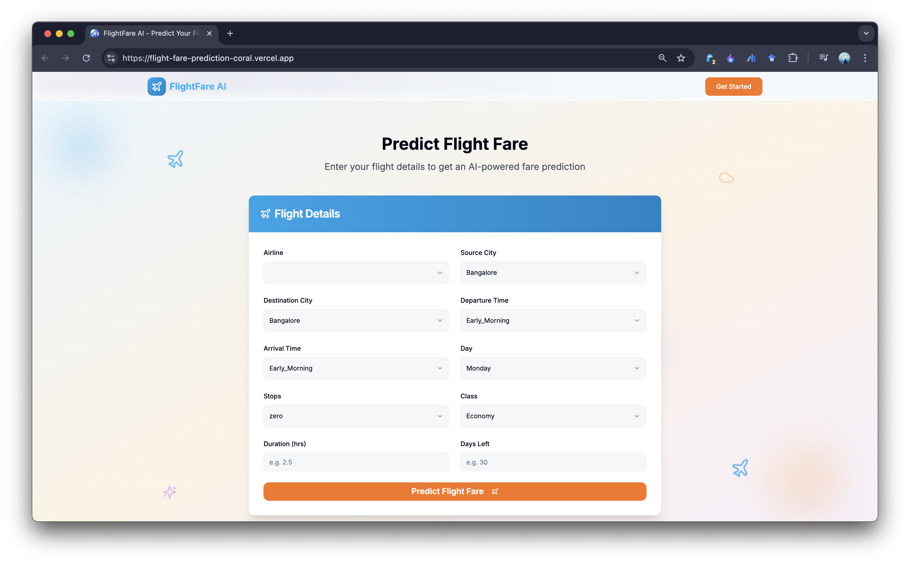
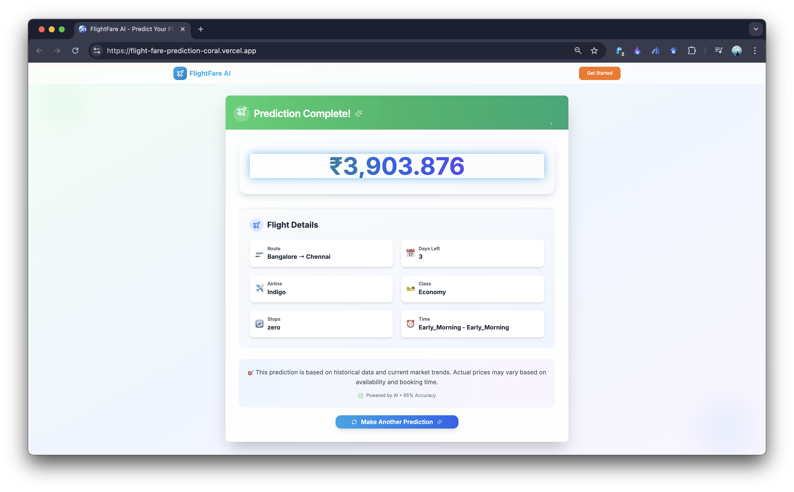

# ✈️ Flight Fare Prediction Project

## 📄 Abstract
[Click to read](./abstract/abstract.md)

## 📁 Dataset
Dataset is located in: [here](./dataset/flight_data.csv)

## 🔧 Tech Stack
- Python (Flask)
- React + Vite
- Tailwind CSS
- scikit-learn, pandas, joblib
- Hosted on: Render (backend) & Vercel (frontend)

## 🔗 Backend Repository
👉 [Visit Backend Repository](https://github.com/fayezmuhammed/ffp-backend.git)

## 🌐 Live Website
👉 [Visit Flight Fare Predictor](https://flight-fare-prediction-coral.vercel.app/)

## 📸 Screenshots

### Homepage

### Prediction Page

### Result Page

## Model Training
The machine learning model for this project was trained and evaluated in a Google Colab notebook. You can view the complete data analysis, model training, and evaluation process here:
[Google Collab link](https://colab.research.google.com/drive/1OBWzqliYReAa0ditK3EpB4tgT-rhtFvw?usp=sharing)

## Developed by
[Antony I Tom](https://www.linkedin.com/in/antony-isaac-tom-1064452b2/), [Fayez Muhammed](https://www.linkedin.com/in/fayezmuhammed/), [Milan Martin](https://www.linkedin.com/in/milanmartin142/), [Sivaprasad S](https://www.linkedin.com/in/sivaprasad-s22/)

